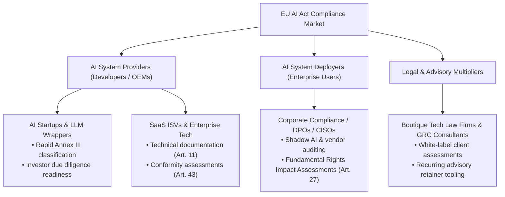
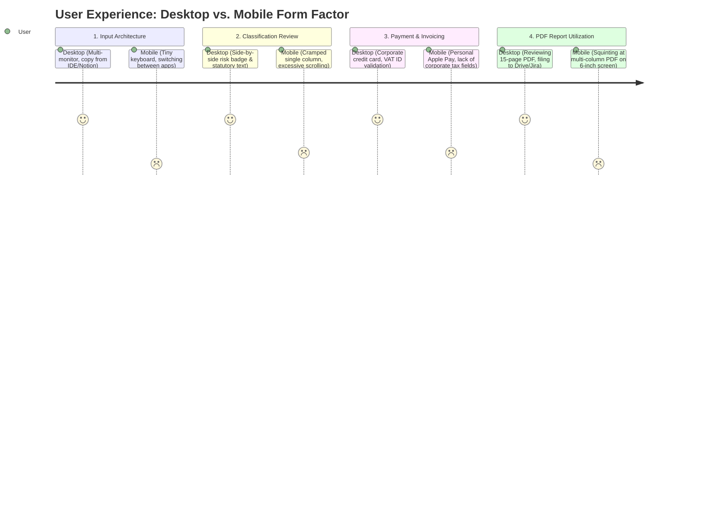
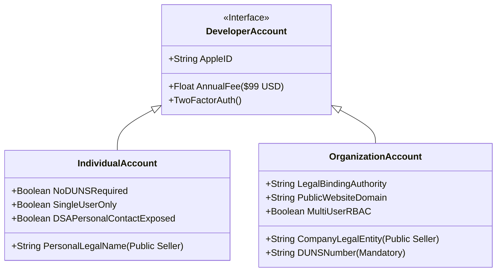
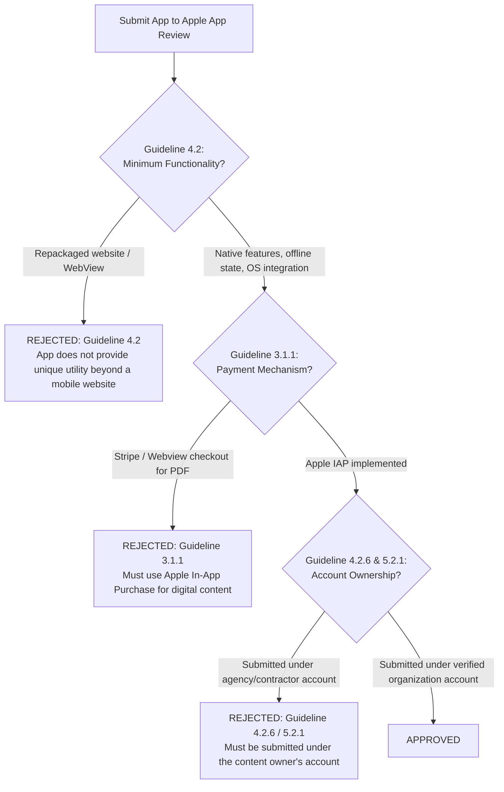
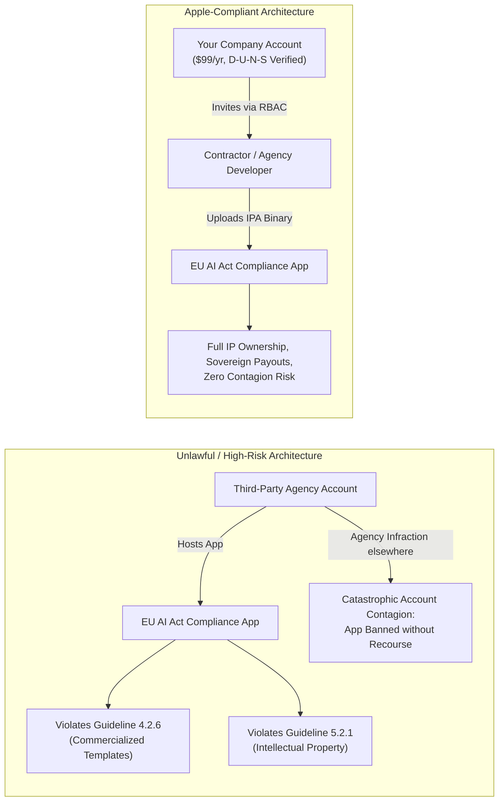
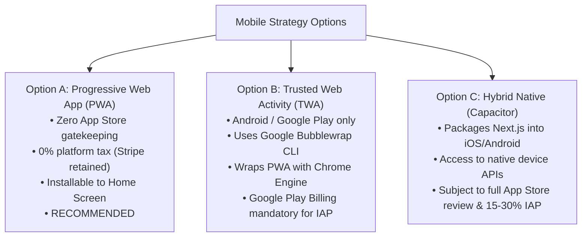
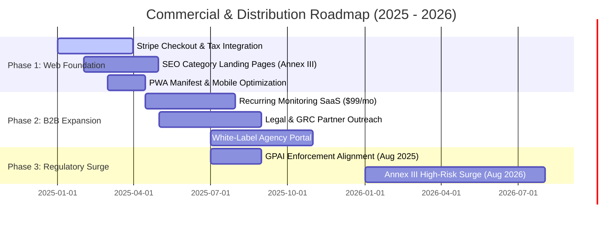

# Commercialization and Mobile App Store Strategy: EU AI Act Compliance Checker

**Document Version:** 1.0.0  
**Target Application:** EU AI Act Compliance Checker (Next.js, Supabase, Google Gemini, Stripe, `@react-pdf/renderer`)  
**Scope:** Regulatory Market Dynamics, Monetization Models, B2B Procurement Ergonomics, Apple App Store & Google Play Policy Deep Dive, and Distribution Architecture.

---

## Executive Summary & Strategic Verdict

| Strategy Dimension | Recommendation | Primary Justification |
| :--- | :--- | :--- |
| **Primary Platform** | **Responsive Desktop Web App (PWA)** | B2B compliance workflows require multi-paragraph technical disclosures, legal review, and multi-page PDF generation. Desktop traffic accounts for >95% of enterprise compliance software usage. |
| **Monetization Model** | **Hybrid "Tripwire" to SaaS / White-Label** | A $29–$49 single audit report acts as a self-liquidating top-of-funnel acquisition hook ("tripwire"), converting high-intent users into a $99–$299/month recurring monitoring subscription and $1,500–$5,000/year enterprise/law-firm white-label tiers. |
| **Payment Infrastructure** | **Stripe (Direct Web Checkout)** | Preserves 100% of revenue minus standard processing fees (~1.5% + €0.25 in EEA; 2.9% + $0.30 in US). Enables automated B2B EU VAT reverse-charge invoicing (via Stripe Tax) and corporate expense reconciliation. |
| **Native Mobile App (iOS / Android)** | **Strongly NOT Recommended for Launch** | Unfavorable unit economics (15%–30% platform tax), severe rejection risks under Apple App Store Review Guidelines 4.2 (Minimum Functionality) and 3.1.1 (Mandatory IAP), and near-zero mobile user demand for regulatory document authoring. |
| **iOS Account Strategy** | **Independent Organization Account Only** | Publishing under a third-party agency account violates Apple Guidelines 4.2.6 and 5.2.1, damages enterprise credibility, and introduces fatal account-contagion risks. If an iOS app is ever required, the legal entity must register its own Apple Developer Account ($99/year) with a D-U-N-S number. |

---

## 1. Commercialization & Go-To-Market (GTM) Strategy

### 1.1 Regulatory Timing & Market Drivers
The European Union's Artificial Intelligence Act (**Regulation (EU) 2024/1689**) entered into force on **August 1, 2024**. Compliance deadlines create non-negotiable legal pressure across multiple phases:

*   **February 2, 2025 (6 Months):** Prohibitions under Chapter II (Article 5) take effect (e.g., cognitive behavioral manipulation, untargeted biometric scraping, social scoring, biometric categorization inferring protected characteristics), alongside General AI Literacy obligations (Article 4).
*   **August 2, 2025 (12 Months):** Obligations for General-Purpose AI (GPAI) model governance (Chapter V), notifying authorities (Chapter III, Section 4), and penalties take effect.
*   **August 2, 2026 (24 Months):** Full application for High-Risk AI systems listed in **Annex III** (biometrics, critical infrastructure, education, employment/HR tech, essential private/public services, law enforcement, migration, administration of justice).
*   **August 2, 2027 (36 Months):** Obligations for High-Risk AI systems embedded as safety components in products covered by EU harmonization legislation listed in **Annex I** (medical devices, machinery, civil aviation, toys, automotive).

```
   Aug 1, 2024        Feb 2, 2025          Aug 2, 2025          Aug 2, 2026          Aug 2, 2027
───────┼───────────────────┼────────────────────┼────────────────────┼────────────────────┼──────►
   Entry into         Prohibited AI        GPAI Governance      Annex III High-Risk  Annex I Products
     Force            & AI Literacy          & Penalties        Full Enforcement     Enforcement
```

**Non-compliance penalties** are draconian: up to **€35,000,000 or 7% of total worldwide annual turnover** (whichever is higher) for prohibited AI violations, and up to **€15,000,000 or 3% of worldwide turnover** for high-risk non-compliance. This creates urgent, C-level compliance demand.

---

### 1.2 Target Market Segmentation



#### A. Providers vs. Deployers
*   **Providers (Article 3(3)):** Natural or legal persons that develop an AI system (or have an AI system developed) and place it on the market or put it into service under their own name or trademark.
    *   *Obligations:* Bear ~80% of direct technical burden under Articles 9–17 (Risk Management System, Data Governance, Technical Documentation, Record-Keeping/Logging, Transparency, Human Oversight, Accuracy & Cybersecurity), conformity assessments, and EU database registration.
    *   *Relevance to Checker:* Immediate need for technical architecture classification to determine whether their product falls under Annex III.
*   **Deployers (Article 3(4)):** Natural or legal persons using an AI system under their authority in a professional capacity.
    *   *Obligations:* Must monitor systems for risks (Article 26), ensure input data relevance, maintain logs generated by high-risk systems, and conduct Fundamental Rights Impact Assessments (FRIA, Article 27) when applicable.
    *   *Relevance to Checker:* Need fast vetting of third-party vendor AI tools integrated into their corporate workflows.

#### B. Buyer Personas
1.  **AI Startup Founders & CTOs:**
    *   *Pain Point:* Need immediate answers to: "Is our product considered High-Risk under Annex III?" and "What compliance artifacts do venture capital investors need to see before our Series A?"
    *   *Buying Trigger:* Fundraising due diligence, product launch in the EU market, customer security questionnaire response.
    *   *Willingness to Pay:* $29–$49 for immediate instant audit; $99/month for continuous repository/prompt change monitoring.
2.  **In-House Legal Counsel, Data Protection Officers (DPOs), & CISOs:**
    *   *Pain Point:* Hundreds of internal teams deploying ad-hoc AI agents, fine-tuned models, and OpenAI API integrations without regulatory governance.
    *   *Buying Trigger:* Board-level compliance mandates, upcoming EU regulatory audit deadlines, internal enterprise risk management (ERM).
    *   *Willingness to Pay:* $299–$999/month for centralized organization-wide AI asset inventory and audit trails.
3.  **Boutique Tech Law Firms & Compliance Consultancies:**
    *   *Pain Point:* Manual review of client AI system prompts and architectures is time-consuming; need standardized, professional, white-labeled client intake and preliminary diagnostic reports.
    *   *Buying Trigger:* Scaling billable advisory services without adding linear headcount.
    *   *Willingness to Pay:* $1,500–$5,000/year for multi-tenant white-label portals.

---

### 1.3 Business Model & Pricing Architecture

A pure transactional $29 report leaves significant enterprise value on the table and suffers from high customer acquisition cost (CAC) churn. The optimal strategy utilizes a **three-tier monetization funnel**:

| Tier | Price | Format | Target Customer | Value Proposition |
| :--- | :--- | :--- | :--- | :--- |
| **Tier 1: Instant Audit ("Tripwire")** | **$29 – $49** *(One-time)* | Single Generated PDF Report | Early-stage AI startups, indie developers, solo consultants | Immediate Annex III risk-tier determination, matched Article rationale, and prioritized statutory checklist. Self-liquidates advertising spend. |
| **Tier 2: Compliance Monitor (Core SaaS)** | **$99 – $199 / month** *(Billed annually or monthly)* | Cloud Dashboard + Monitored Registry | Growth-stage AI companies, scaling SaaS vendors, mid-market IT | Up to 10 AI systems monitored, continuous re-evaluation against regulatory amendments, prompt/version diff tracking, downloadable audit history, and shareable compliance badges for customer trust pages. |
| **Tier 3: Enterprise & Legal White-Label** | **$1,500 – $4,999 / year** *(Custom invoicing)* | White-label Portal + Multi-seat License | Boutique law firms, GRC consultants, enterprise legal teams | Branded PDF outputs (client logo & law firm header), client intake links, unlimited system audits, multi-tenant workspace, exportable technical documentation dossier templates for Notified Bodies. |


#### Why the $29 Report is a Tripwire, Not the Endgame
*   **B2B Customer Acquisition Economics:** High-intent Google Search clicks for enterprise keywords ("EU AI Act compliance tool", "Annex III classification") range between $8.00 and $25.00 CPC. At a 5% landing page conversion rate, Customer Acquisition Cost (CAC) easily exceeds $150–$300.
*   **Unit Economics:** A standalone $29 purchase with a $150 CAC produces a catastrophic negative return on investment (-$121 per customer).
*   **The Tripwire Mechanism:** The $29 report converts cold traffic into paying customers with verified corporate payment cards. Once the customer downloads their initial report, the product prompts for system monitoring: *"Regulations and your system prompts change frequently. Monitor this AI system for $99/mo to guarantee ongoing compliance."*

---

### 1.4 Distribution & Customer Acquisition Channels

1.  **Programmatic & Technical SEO (Primary Long-Term Channel):**
    *   *Execution:* Build landing pages indexed around specific high-risk categories in Annex III (e.g., `/compliance/hr-resume-screening-ai`, `/compliance/credit-scoring-ai`, `/compliance/biometric-identification`).
    *   *Search Intent:* Founders and developers search: *"Is resume screening high risk under EU AI Act?"* Landing pages provide immediate answers and route users directly into the free classification text-area.
2.  **Legal & Consulting Channel Partnerships (High-Leverage B2B):**
    *   *Execution:* Partner with boutique European IT law firms and GDPR compliance consultancies. Provide them with an agency dashboard or revenue-share affiliate model (20%–30% recurring).
    *   *Value to Partner:* Law firms charge their clients €2,500–€5,000 for an AI compliance intake review, using this checker to automate the initial 3 hours of technical analysis.
3.  **Targeted Outbound via LinkedIn & Tech Databases:**
    *   *Execution:* Query Crunchbase, Dealroom, and Product Hunt for EU-based startups that raised funding in 2024–2026 with tags "AI", "Machine Learning", "LLM", or "GenAI".
    *   *Outreach Angle:* Address the CTO or DPO directly: *"Notice you're offering AI-driven automated evaluation. Have you generated your Annex III technical classification dossier for EU market entry?"*
4.  **Developer & Open-Source Ecosystem Infiltration:**
    *   *Execution:* Publish a free GitHub Action (`eu-ai-act-linter`) or Hugging Face Space that performs preliminary triage and links back to the full web app for the official certified PDF report.

---

## 2. Mobile vs. Desktop Ergonomics & Enterprise Procurement

### 2.1 User Workflow & Ergonomic Realities

The EU AI Act Compliance Checker is an analytical, document-intensive legaltech instrument. Evaluating the workflow across form factors highlights severe ergonomic friction on mobile devices:



#### Detailed Workflow Comparison
*   **System Prompt & Architecture Input:**
    *   *Desktop:* Users copy multi-paragraph system prompts, API schemas, and architecture summaries directly from VS Code, GitHub, Jira, or Notion. Form fields accommodate extensive technical syntax.
    *   *Mobile:* Multi-tasking between native notes or codebases and a mobile form is error-prone. Clipboard truncation, auto-correct corruption of code strings, and lack of screen real estate create extreme input friction.
*   **Report Review & PDF Archiving:**
    *   *Desktop:* The output is an extensive, multi-page regulatory assessment citing Articles 9 through 17. Users review this on 14"–32" monitors, annotate key obligations, print or download to corporate repositories (Google Drive, SharePoint, OneDrive), and attach it to internal compliance tickets.
    *   *Mobile:* Consuming a structured, multi-page compliance dossier on a 6-inch smartphone screen is fundamentally impractical for legal and engineering personnel.

---

### 2.2 B2B Enterprise Procurement & Payment Behavior

Enterprise purchasing dynamics operate under strict accounting and legal protocols that are incompatible with mobile app store ecosystems:

1.  **Corporate Tax & VAT Reverse-Charge Rules:**
    *   Under European VAT law (Directive 2006/112/EC), cross-border B2B digital services within the EU require **reverse-charge VAT treatment** (0% VAT applied upon entry of a valid VIES-registered VAT identification number).
    *   **Stripe Web Checkout** natively supports automated EU VAT validation via Stripe Tax, applying reverse-charge mechanics and generating compliant tax invoices with both seller and buyer VAT IDs.
    *   **Apple App Store / Google Play In-App Purchases (IAP)** treat transactions primarily as B2C retail sales. Apple collects local consumer VAT by default and does not provide an automated checkout mechanism for enterprise buyers to enter a corporate VAT number for immediate reverse-charge exemption.
2.  **Payment Methods & Expense Auditing:**
    *   Enterprise software is procured via corporate expense cards (Ramp, Brex, corporate Amex) or accounts payable (invoiced Purchase Orders).
    *   In-app purchases are linked to an employee's personal Apple ID or Google Play account. Attempting to charge a $99/month recurring compliance subscription or $29 report to a personal Apple ID requires employee expense reimbursement, which enterprise finance departments routinely reject or discourage for corporate compliance tools.
3.  **Industry Desktop Usage Benchmarks:**
    *   According to cross-industry analytics benchmarks from SaaS platforms (Mixpanel, Amplitude) in the LegalTech, RegTech, and Developer Tools sectors:
        *   **Desktop Web Traffic:** **94.2% – 97.8%**
        *   **Mobile Web/App Traffic:** **2.2% – 5.8%**
    *   Allocating engineering resources to native mobile apps targets less than 6% of active users while introducing 80% of ongoing platform maintenance overhead.

---

### 2.3 Web App / PWA vs. Native App Overhead Matrix

| Evaluation Dimension | Responsive Web App / PWA (Current Stack) | Native Mobile App (iOS / Android) |
| :--- | :--- | :--- |
| **Transaction Fees** | **~1.5% + €0.25 (EEA) / 2.9% + $0.30 (US)** via Stripe | **15% to 30%** mandatory platform cut |
| **Deployment Speed** | **Instant (Zero Gatekeeping)** via Vercel git push | **1 to 7 Days** App Store review delays per release |
| **B2B Invoicing & VAT** | **Full Native Support** (Stripe Tax, Reverse-Charge, Invoicing) | **Poor/Non-Existent** (Consumer Apple/Google receipts) |
| **Review Risk / Rejection**| **0% (Complete Sovereign Control)** | **High Risk** (Guideline 4.2 Minimum Functionality, 3.1.1 IAP) |
| **Maintenance Burden** | **Single Monolithic Codebase** (Next.js App Router) | **Multi-codebase / Bridge Overhead** (Xcode, Gradle, Swift/Kotlin) |
| **Account Overhead** | **$0** (Standard domain & Vercel hosting) | **$99/yr (Apple) + $25 (Google)** + D-U-N-S verification |
| **Regulatory Burden** | Standard GDPR Privacy Policy & Terms | Mandatory EU DSA Trader public disclosure (address/phone) |

---

## 3. Apple App Store Deep Dive: Legal, Financial, & Review Policies

If commercializing or distributing this compliance tool via the Apple App Store, developers must adhere to strict contractual and operational mandates outlined in the **Apple Developer Program License Agreement (DPLA)** and the **App Store Review Guidelines**.

---

### 3.1 Developer Account Requirements: Individual vs. Organization

Apple offers two distinct enrollment tiers for the Apple Developer Program ($99 USD / year):



#### A. Individual Developer Account
*   **Seller Identity:** The app seller name displayed on the App Store is the **legal personal first and last name** of the account holder. Doing Business As (DBA), trade names, or fictitious business names are strictly prohibited.
*   **Access Control:** Single-user account. No secondary team logins or granular role-based access control (RBAC) in App Store Connect.
*   **Privacy Exposure under EU Digital Services Act (DSA):** Under EU Regulation 2022/2065 (DSA Article 30), any developer offering paid apps or digital goods in the EU must declare **Trader Status**. For Individual accounts, Apple is legally mandated to publicly display the individual's **verified personal physical address, telephone number, and email address** directly on the App Store product page.

#### B. Organization Developer Account (Strict B2B Standard)
*   **Legal Entity Verification:** The organization must be a registered legal entity (Corporation, LLC, GmbH, S.A.S., Ltd.).
*   **D-U-N-S® Number:** Mandatory 9-digit identifier issued by Dun & Bradstreet. Apple validates that the company name, address, and legal entity status on D&B match the enrollment submission exactly.
*   **Legal Authority Verification:** The person enrolling must possess legal binding authority (Owner, Founder, CEO, or authorized corporate representative verified via corporate email domain).
*   **Team Permissions:** Grants multi-user management in App Store Connect with granular roles (Admin, Finance, App Manager, Developer).
*   **Enterprise Credibility:** The seller name appears as the corporate entity (e.g., *"Acme Compliance Technologies Ltd"*), essential for building trust with enterprise B2B buyers.

---

### 3.2 In-App Purchase (IAP) Rules & Financial Impact

#### Guideline 3.1.1 (In-App Purchase)
> *"If you want to unlock features or functionality within your app, (by way of example: subscriptions, in-game currencies, game levels, access to premium content, or unlocking a full version), you must use in-app purchase. Apps may not use their own mechanisms to unlock content or functionality, such as license keys, augmented reality markers, QR codes, cryptocurrencies and cryptocurrency wallets, etc."*  
> *(Source: Apple App Store Review Guidelines, Section 3.1.1)*

*   **Direct Application to this Checker:** Unlocking a full PDF compliance report or purchasing access to the AI classification analysis within an iOS app is classified as unlocking a digital good/service.
*   **Prohibition of Third-Party Checkout:** Developers **cannot** display a Stripe payment form, credit card input, or link to a web checkout page inside the iOS application to sell digital reports. Attempting to do so results in immediate binary rejection.
*   **Commission Structures:**
    *   **Standard Rate:** **30%** cut on all transactions and first-year subscriptions.
    *   **App Store Small Business Program:** **15%** cut for developers earning under $1,000,000 USD in total annual proceeds across all associated accounts (requires manual enrollment and approval).
    *   **Second-Year Subscriptions:** Reduces from 30% to 15% for active recurring subscriptions persisting beyond 12 consecutive months.

#### Financial Comparison: Stripe Web vs. Apple IAP

To demonstrate the margin destruction of selling compliance reports on iOS versus the existing Next.js + Stripe architecture, consider processing 1,000 audit reports at $29:

| Financial Metric | Web App via Stripe (EEA / Standard) | Apple IAP (Small Business - 15%) | Apple IAP (Standard - 30%) |
| :--- | :--- | :--- | :--- |
| **Gross Volume (1,000 x $29)** | $29,000.00 | $29,000.00 | $29,000.00 |
| **Platform Fee / Commission** | $0.00 (0%) | -$4,350.00 (15%) | -$8,700.00 (30%) |
| **Payment Processing Fee** | -$560.00 (Stripe ~1.5% + €0.25) | Included in Apple cut | Included in Apple cut |
| **Annual Developer Fee** | $0.00 | -$99.00 | -$99.00 |
| **Net Payout to Developer** | **$28,440.00** | **$24,551.00** | **$20,201.00** |
| **Margin Loss vs. Web** | **$0.00 (Baseline)** | **-$3,889.00 (-13.7%)** | **-$8,239.00 (-28.9%)** |

Selling via the App Store forfeits nearly **$8,239 in gross margin per 1,000 transactions**, with zero added technical value.

---

### 3.3 Critical App Store Review Guidelines & Rejection Vectors



#### A. Guideline 4.2: Minimum Functionality
> *"Your app should include features, content, and UI that elevate it beyond a repackaged website. If your app is not particularly useful, unique, or 'app-like,' it doesn't belong on the App Store."*  
> *(Source: Apple App Store Review Guidelines, Section 4.2)*

*   **The "WebView Trap":** Packaging the existing Next.js web application into an iOS binary using a simple `WKWebView` (e.g., standard Capacitor or Cordova wrapper without deep native integrations) is the most frequent cause of rejection for SaaS utilities.
*   **App Review Assessment:** If the App Review team observes that the app merely presents a text area, runs an API call, and displays a PDF that could easily be accessed in Safari, it will be rejected under Guideline 4.2.
*   **Remediation Requirement:** Passing Guideline 4.2 requires building deep native mobile integrations: iOS Files app sync, native CoreGraphics PDF annotation, offline caching, push notifications for regulatory updates, or biometric authentication.

#### B. Guideline 3.1.3: Exceptions to In-App Purchase
Apple provides narrow exemptions where third-party web billing is permitted inside an app:

*   **Guideline 3.1.3(b) - Multiplatform Services:**
    *   *Rule:* Apps that operate across multiple platforms may allow users to access content, subscriptions, or features acquired outside the app (e.g., on your website).
    *   *The Catch:* **The exact same digital content or subscription MUST also be offered for purchase via Apple In-App Purchase within the app.** You cannot use this guideline to bypass IAP for users wishing to buy inside the iOS application.
*   **Guideline 3.1.3(c) - Enterprise Services:**
    *   *Rule:* If the app is sold exclusively directly by the developer to organizations or groups for their employees (B2B contract sales), it may use external payment methods.
    *   *The Catch:* **Consumer, single-user, or self-serve purchases do not qualify.** If a user can download the app and buy a single $29 report or $99 self-serve monthly plan, Guideline 3.1.3(c) does not apply, and Apple IAP remains mandatory.

---

## 4. Google Play Store & The "Outsourcing to iOS" Fallacy

### 4.1 Google Play Store Policies & Operational Economics

*   **Account Registration Fee:** A one-time registration fee of **$25 USD** (payable via credit card; prepaid cards not accepted).
*   **D-U-N-S Requirement for Organizations:** Since August 31, 2023, Google Play mandates that all newly created **Organization Developer Accounts** provide a verified D-U-N-S number matching official business documentation.
*   **Personal Account 20-Tester Barrier:** For personal developer accounts created after November 13, 2023, Google imposes a strict testing requirement: **developers must run a closed test with a minimum of 20 opted-in testers for at least 14 consecutive days** before applying for production access. Organization accounts are exempt from this requirement, making Organization status mandatory for viable commercial deployment.
*   **Google Play Billing Policy:** Like Apple, Google mandates **Google Play's billing system** for all in-app purchases of digital goods and services (including digital reports, audits, and cloud software access). Google charges a **15% service fee** on the first $1,000,000 USD of earnings each year upon enrollment in the 15% service fee tier (30% thereafter).

---

### 4.2 Outsourcing iOS Publishing: The "Someone Else's Account" Fallacy

A frequent question among early-stage software founders is:  
> *"Can we publish on Google Play ourselves, but outsource our iOS publishing to an agency or third-party contractor to release under their Apple Developer account?"*

**The definitive answer is NO.** Attempting to publish a proprietary B2B SaaS compliance tool under an agency's, contractor's, or third-party publisher's Apple Developer account is a critical anti-pattern that violates Apple guidelines and introduces catastrophic business risks.



#### Why Publishing Under a Third-Party Account Fails

1.  **Direct Violation of Guideline 4.2.6(a):**
    > *"Apps created from a commercialized template or app generation service will be rejected unless they are submitted directly by the provider of the app's content. These services should not submit apps on behalf of their clients and should offer tools that let their clients create own apps or submit content directly to Apple."*  
    > *(Source: Apple App Store Review Guidelines, Section 4.2.6)*
2.  **Intellectual Property Rejection under Guideline 5.2.1:**
    *   Apple requires apps to be submitted by the legal entity that owns or has licensed the brand, product, and intellectual property.
    *   If an agency named "DevStudio Inc." submits an app named "EU AI Act Compliance Checker" representing your software product, Apple App Review routinely halts review under Guideline 5.2.1, requesting signed trademark licenses, intellectual property assignments, or demanding that the actual product owner submit the app from their own developer account.
3.  **App Store Connect "App Transfer" Realities:**
    *   While Apple provides an **App Transfer** feature to move apps between accounts, the transfer requirements state that **both the transferor and the recipient must have active, paid Apple Developer Program accounts** ($99/year each).
    *   Transferring an app cannot bypass the $99/year fee or the corporate verification process.
4.  **Catastrophic Account Contagion Risk:**
    *   Apple actively monitors developer associations. Under Section 11 of the Apple Developer Program License Agreement, if an agency's account is suspended, terminated, or flagged for fraudulent activity (e.g., another client of the agency commits copyright infringement or violates payment rules), **every single application hosted under that agency's account is terminated simultaneously.**
    *   You have zero legal standing with Apple to appeal the deletion of your app if you are not the registered account owner.
5.  **Financial & Payout Entanglement:**
    *   Apple pays In-App Purchase proceeds exclusively to the bank account registered to the developer account holder.
    *   If an agency hosts your app, all mobile revenue flows into the agency's bank account. You become dependent on third-party accounting, auditing, and payout cycles, exposing your business to insolvency or dispute risks.

#### The Only Legitimate Way to Outsource iOS Development
1.  **You Register the Account:** Your legal entity enrolls in the Apple Developer Program ($99/year) and completes D-U-N-S verification.
2.  **You Grant Role-Based Access:** Log in to App Store Connect -> *Users and Access*, and invite the external agency or contractor using their Apple ID with the **"Developer"** or **"App Manager"** role.
3.  **Contractor Builds & Uploads:** The contractor develops the application and uploads the binary directly to your App Store Connect workspace using Xcode, fastlane, or GitHub Actions.
4.  **You Retain Sovereign Control:** Your legal entity signs legal agreements, holds the private distribution certificates, configures corporate bank accounts, and retains 100% ownership of App Store reviews and customer relationships.

---

### 4.3 Technical Alternatives for Mobile Presence

If mobile distribution is required by stakeholders, three technical paths exist:



#### Option A: Progressive Web App (PWA) — *Recommended*
*   **Implementation:** Add a Web App Manifest (`manifest.json`), service worker, and standard Apple mobile web meta tags (`apple-touch-icon`, `apple-mobile-web-app-capable`) to the existing Next.js application.
*   **User Experience:** Mobile Safari and Chrome users can tap *"Add to Home Screen"*. The app launches in standalone, full-screen mode without browser chrome.
*   **Commercial Advantage:**
    *   **0% App Store fees:** All payments process via Stripe.
    *   **Zero App Review delays:** Updates deploy instantly via Vercel.
    *   **Zero account overhead:** No Apple Developer ($99) or Google Play ($25) enrollment required.

#### Option B: Trusted Web Activity (TWA) on Google Play
*   **Implementation:** Use Google's official command-line tool `bubblewrap` to generate an Android App Bundle (`.aab`) that opens the verified web URL inside a customized, chromeless Android Chrome instance.
*   **Verification:** Verified via Digital Asset Links (`/.well-known/assetlinks.json`).
*   **Viability:** Viable for obtaining a Google Play listing at low cost, but digital sales must comply with Google Play Billing if triggered within the app.

#### Option C: Capacitor / React Native Bridge
*   **Implementation:** Wrap the frontend inside an Ionic Capacitor shell to access native device APIs (native push notifications, biometric FaceID).
*   **Viability:** High maintenance overhead. Forces full compliance with Apple Review Guideline 3.1.1 (IAP integration) and Guideline 4.2 (must write custom native code to avoid rejection). Only viable if specific native hardware APIs are required.

---

## 5. Strategic Roadmap & Implementation Plan



### Phase 1: High-Conversion Desktop Web Experience (Current – Q2 2025)
1.  **Keep the Next.js Monolith on Vercel:** Do not spend engineering resources on native iOS/Android codebases.
2.  **Optimize the Tripwire Funnel:**
    *   Price the single downloadable PDF audit report at **$29–$49**.
    *   Ensure the post-payment flow prompts for permanent account registration (setting password via `supabase.auth.updateUser()`).
3.  **Deploy B2B Tax & Invoicing via Stripe:**
    *   Enable **Stripe Tax** to automate EU VAT reverse-charge calculation upon entry of a valid corporate VAT ID.
    *   Configure automated delivery of itemized PDF tax receipts to satisfy corporate finance departments.
4.  **Add PWA Support:**
    *   Implement standard `manifest.json` and mobile responsive breakpoints to support frictionless tablet and mobile browser viewing without app store overhead.

### Phase 2: B2B Recurring SaaS & White-Label Portal (Q3 2025 – Q4 2025)
1.  **Launch System Registry ($99–$199/month):**
    *   Allow users to monitor up to 10 AI models or prompt configurations.
    *   Provide automated alerts when regulatory guidance changes (e.g., EU AI Office publishes GPAI Codes of Practice).
2.  **Develop White-Label Tier for Law Firms ($1,500–$4,999/year):**
    *   Provide custom-branded PDF exports (law firm branding).
    *   Provide multi-client management for compliance consultants.

### Phase 3: Mobile Evaluation Gate (Pre-Annex III Enforcement, Q1 2026)
*   **Evaluate Mobile Demand:** Re-assess mobile analytics. If and only if mobile web traffic exceeds 15% and corporate clients demand an offline tablet auditor tool:
    *   Incorporate the business as a verified legal entity.
    *   Obtain a corporate **D-U-N-S Number**.
    *   Register a dedicated **Apple Developer Organization Account** ($99/year).
    *   Contract native mobile engineers via role-based access in App Store Connect.
    *   Utilize **Guideline 3.1.3(c) Enterprise Licensing** for B2B contract sales or implement dual IAP/Stripe multiplatform parity.

---

## Appendix: Primary Sources & Official References

### Apple Developer Documentation & Guidelines
*   **Apple App Store Review Guidelines:**  
    [https://developer.apple.com/app-store/review/guidelines/](https://developer.apple.com/app-store/review/guidelines/)  
    *Key Sections Cited:* Guideline 3.1.1 (In-App Purchase), Guideline 3.1.3(b) (Multiplatform Services), Guideline 3.1.3(c) (Enterprise Services), Guideline 4.2 (Minimum Functionality), Guideline 4.2.6 (Commercialized Templates), Guideline 5.2.1 (Intellectual Property).
*   **Apple Developer Program Enrollment & Legal Verification:**  
    [https://developer.apple.com/support/enrollment/](https://developer.apple.com/support/enrollment/)  
    *Requirements Cited:* Legal Entity status, D-U-N-S Number lookup, Legal Binding Authority requirements.
*   **Apple App Store Small Business Program (15% Commission):**  
    [https://developer.apple.com/app-store/small-business-program/](https://developer.apple.com/app-store/small-business-program/)
*   **Apple Compliance with EU Digital Services Act (DSA):**  
    [https://developer.apple.com/support/dsa-trader-requirements/](https://developer.apple.com/support/dsa-trader-requirements/)  
    *Requirements Cited:* Mandatory Trader status declaration, public disclosure of physical address, phone, and email for commercial publishers.
*   **App Store Connect: App Transfer Policy:**  
    [https://developer.apple.com/help/app-store-connect/transfer-an-app/overview-of-app-transfer/](https://developer.apple.com/help/app-store-connect/transfer-an-app/overview-of-app-transfer/)

### Google Play Developer Policies
*   **Google Play Developer Registration & Fees:**  
    [https://support.google.com/googleplay/android-developer/answer/6112435](https://support.google.com/googleplay/android-developer/answer/6112435)  
    *Requirements Cited:* $25 USD registration fee, D-U-N-S number verification for organization accounts.
*   **Google Play Testing Requirements (20 Testers / 14 Days):**  
    [https://support.google.com/googleplay/android-developer/answer/14151465](https://support.google.com/googleplay/android-developer/answer/14151465)
*   **Google Play Payments & In-App Billing Policy:**  
    [https://support.google.com/googleplay/android-developer/answer/9858738](https://support.google.com/googleplay/android-developer/answer/9858738)  
    *Requirements Cited:* Mandatory use of Google Play Billing for digital goods and 15% service fee tier.
*   **Trusted Web Activities (TWA) & Bubblewrap Documentation:**  
    [https://developer.chrome.com/docs/android/trusted-web-activity/](https://developer.chrome.com/docs/android/trusted-web-activity/)

### European Union Regulatory Statutes
*   **Regulation (EU) 2024/1689 (Artificial Intelligence Act):**  
    Official Journal of the European Union (OJ L 2024/1689, 12.7.2024).  
    [https://eur-lex.europa.eu/legal-content/EN/TXT/?uri=CELEX:32024R1689](https://eur-lex.europa.eu/legal-content/EN/TXT/?uri=CELEX:32024R1689)  
    *Articles Cited:* Article 3 (Definitions of Provider and Deployer), Article 4 (AI Literacy), Article 5 (Prohibited AI Practices), Articles 9–17 (High-Risk System Obligations), Article 26–27 (Deployer Obligations & FRIA), Article 99–101 (Penalties & Fines), Annex I & Annex III (High-Risk Classifications).
*   **Regulation (EU) 2022/2065 (Digital Services Act):**  
    [https://eur-lex.europa.eu/legal-content/EN/TXT/?uri=CELEX:32022R2065](https://eur-lex.europa.eu/legal-content/EN/TXT/?uri=CELEX:32022R2065)  
    *Articles Cited:* Article 30 (Traceability of Traders).
*   **Council Directive 2006/112/EC (Common System of Value Added Tax - B2B Reverse-Charge):**  
    [https://eur-lex.europa.eu/legal-content/EN/TXT/?uri=CELEX:32006L0112](https://eur-lex.europa.eu/legal-content/EN/TXT/?uri=CELEX:32006L0112)

### B2B Payment & Billing Documentation
*   **Stripe Tax & European VAT Reverse-Charge Automation:**  
    [https://docs.stripe.com/tax/eu-vat](https://docs.stripe.com/tax/eu-vat)  
    *Features Cited:* Automated VIES validation, reverse-charge calculation for B2B digital services.
